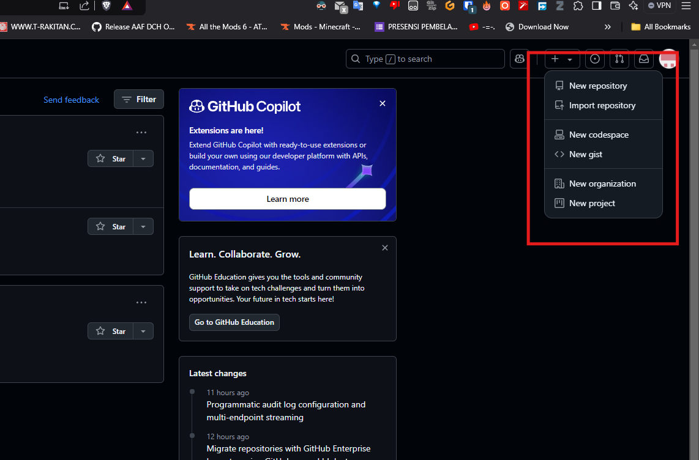

[](https://classroom.github.com/a/tbEHDGEc)

# Git and Github Introduction


| Nama               | Division | Sub-Division      |
| -------------------- | ---------- | ------------------- |
| Dharon Yusuf Fuadi | ELC      | Electrical Design |

## Early Procedure

### 1. Install Git

https://git-scm.com/downloads

### 2. Create an account

https://github.com/join

### 3. Set Username and Email (Using the CLI)

```
git config --global user.name (Insert Username)
git config --global user.email (Insert Email
)
```

### 4. Add SSH keys to Github


##### a. Open Github then go to Settings -> SSH and GPG keys -> New SSH key

##### b. Create SSH key

```
ssh-keygen -t ed25519 -C (Insert Email)
```

##### c. copy SSH key

```
cat ~/.ssh/id_ed25519.pub
### Copy the output ###
```

##### d. Paste the SSH key to "New SSH Key" on Github

## Create Repository

### Create the Repository

#### a. Open Github

#### b. Click Create New




#### c. Click New Repository

#### d. Configure the Repository (Name, Access Type) then create the Repository

#### e. Open the Repository

#### f. Click code then copy the ssh link

### Clone to local machine

```
cd <FOLDER>
git clone <SSH LINK> <-- Creates a new folder
cd <NEW FOLDER>
git branch -M main
```

## Push File from Local to Github
```
git add . <-- Adds file changes
git commit -m <MESSAGE> <-- Commit changes to Repository
git push origin <Branch> <-- Pushes changes to Github
```

## Create New Branch in Github
### a. Open terminal at local repository folder
### b. Create a new branch then push to github
```
git checkout -B <BRANCH_NAME> <-- Creates new branch
git checkout <BRANCH_NAME> <-- Switches to new branch
git push origin -u <BRANCH_NAME> <-- Pushes the new branch to Github
```
## Delete Branch in Github
### a. Open terminal at local repository folder
### b. Delete Local branch then delete remote branch
```
git checkout <ANY_BRANCH> <-- Switches to other branches
git checkout -d <BRANCH_TO_DELETE> <-- Deletes local branch
git push origin --delete <BRANCH_TO_DELETE> <-- Deletes remote branch at Github
```

## Merging Branch in Github
```
git checkout <BRANCH> <-- Switches to the branch to be merged into
git merge <BRANCH_TO_MERGE> <-- Merges the selected branch to current branch
```

