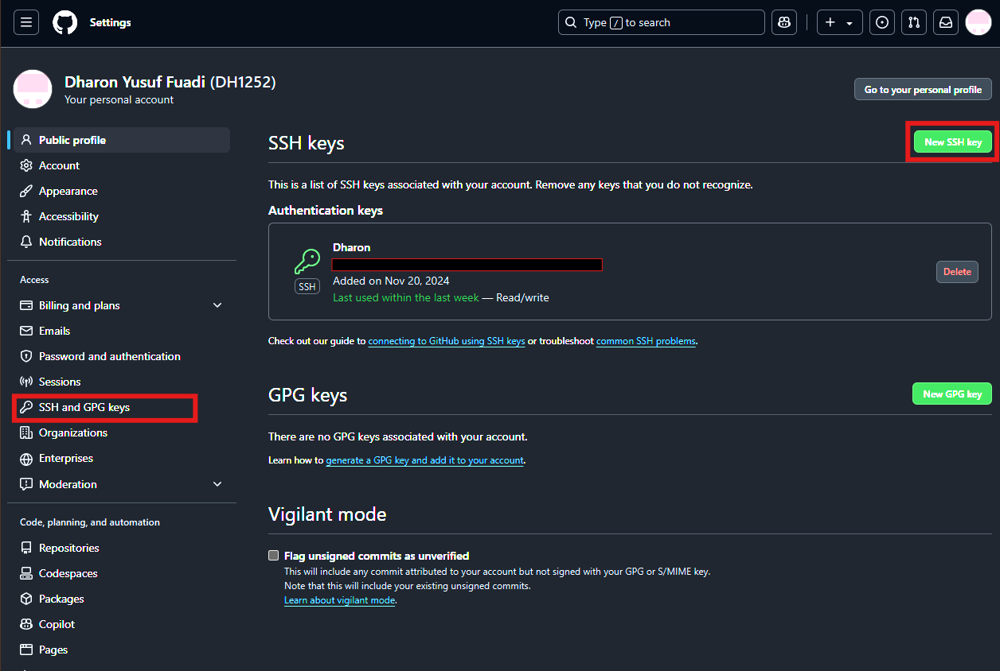

[](https://classroom.github.com/a/tbEHDGEc)

# Git and Github Introduction


| Nama               | Division | Sub-Division      |
| -------------------- | ---------- | ------------------- |
| Dharon Yusuf Fuadi | ELC      | Electrical Design |

## Early Procedure

### 1. Install Git

https://git-scm.com/downloads

### 2. Create an account

https://github.com/join

### 3. Set Username and Email (Using the CLI)

```
git config --global user.name (Insert Username)
git config --global user.email (Insert Email
)
```

### 4. Add SSH keys to Github




##### a. Open Github then go to Settings -> SSH and GPG keys -> New SSH key

##### b. Create SSH key

```
ssh-keygen -t ed25519 -C (Insert Email)
```

##### c. copy SSH key

```
cat ~/.ssh/id_ed25519.pub
### Copy the output ###
```

##### d. Paste the SSH key to "New SSH Key" on Github

## Create Repository

## Push File from Local to Github

## Create New Branch in Github

## Delete Branch in Github

## Merging Branch in Github

## Other Procedure
